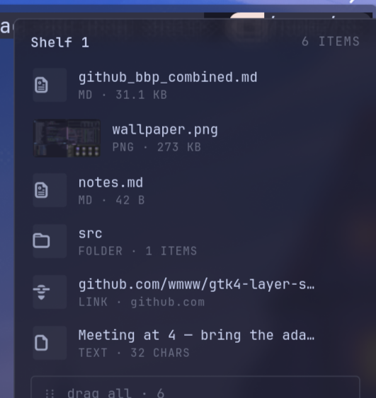

# shelf

A drop shelf for Wayland. Drag anything to the edge of the screen — a shelf slides
out, takes it, and keeps it until you drag it back out somewhere else. Files,
folders, text, links, images straight from the browser.

Built for Hyprland. Works on any compositor with `wlr-layer-shell` and a
StatusNotifier tray (waybar, quickshell, …).



## Why

On a tiling compositor, moving something between two windows means juggling
workspaces while holding the mouse button. macOS has Dropover, Windows has
Dropshelf; Wayland had nothing native. `shelf` is that missing piece: an
invisible 3 px strip on the screen edge that turns into a panel the moment a
drag touches it, and stays out of the way otherwise.

## How it feels

- **Drag to the right edge.** The panel slides in at your pointer. Drop.
- **`Super+Shift+Z`** toggles the panel at the pointer — it works mid-drag too.
- **Drag things back out** one by one, multi-select with `Ctrl`/`Shift`-click, or
  grab the *drag all* handle at the bottom. Dragging out removes the item from
  the shelf; hold `Ctrl` while dragging to keep it.
- **Keep a shelf in the tray.** *New shelf* stashes the current one — with
  everything on it — behind the tray icon. Switch back any time; shelves survive
  restarts.
- `Ctrl+V` pastes the clipboard onto the shelf · `Ctrl+C` copies the selection ·
  `Enter` opens · `Delete` removes · `Esc` closes · right-click for the menu
  (rename, new shelf, switch, clear, delete).
- Files are held **by reference** — nothing is copied or moved until you drag it
  out. Images dragged from a browser are captured into
  `~/.local/share/shelf/blobs/`, so they stay even after the tab is gone.

## Install

Requirements: Python ≥ 3.12, GTK 4, gtk4-layer-shell, gobject-introspection,
cairo (PyGObject is built from PyPI against them).

```sh
# Arch
sudo pacman -S gtk4 gtk4-layer-shell gobject-introspection cairo

# from a clone
uv tool install .          # → ~/.local/bin/shelf
shelf install              # Hyprland rules + keybind + autostart
hyprctl reload
shelf                      # start it now (exec-once handles future logins)
```

`shelf install` writes `~/.config/hypr/shelf.conf` and adds one `source =` line
to `hyprland.conf`:

```ini
layerrule = blur on, match:namespace ^shelf$
layerrule = ignore_alpha 0.2, match:namespace ^shelf$
layerrule = noanim on, match:namespace ^shelf$

bind = SUPER SHIFT, Z, exec, /home/you/.local/bin/shelf toggle
exec-once = /home/you/.local/bin/shelf
```

Use `shelf install --bind 'SUPER, Z'` for a different key. Nothing else is
touched; delete `shelf.conf` and the `source` line to undo.

## CLI

| command | |
|---|---|
| `shelf` | start the daemon |
| `shelf toggle` / `show` / `hide` | control the panel (use from keybinds) |
| `shelf new` | start a new shelf, keep the current one in the tray |
| `shelf add ITEM…` | put files, folders, URLs or text on the shelf from a script |
| `shelf quit` | stop the daemon (waits for any drag in progress) |
| `shelf config` | write `~/.config/shelf/config.toml` with the defaults |

## Configuration

`~/.config/shelf/config.toml` — every key optional:

```toml
edge = "right"            # "right" or "left"
width = 320               # logical pixels
max_height = 0.7          # of the screen; the list scrolls beyond that
strip_width = 3           # the invisible edge trigger
opacity = 0.8             # panel alpha; pairs with the blur rule
radius = 6
font = "JetBrainsMono Nerd Font, JetBrains Mono, monospace"
font_size = 12
auto_collapse_ms = 1200   # after the pointer leaves
linger_after_drop_ms = 2500
remove_on_drag_out = true # Ctrl-drag keeps the item either way

[palette]                 # defaults are catppuccin mocha
bg = "#1e1e2e"  surface = "#313244"  fg = "#cdd6f4"  muted = "#6c7086"
dim = "#585b70" accent = "#89b4fa"   danger = "#f38ba8" border = "#45475a"
```

## How it works

Wayland gives a client no way to see a drag until the pointer is over one of
its own surfaces, so there is no "shake to summon". Instead `shelf` keeps one
full-height layer-shell surface mapped on the screen edge at all times, with its
**input region** shrunk to a 3 px strip. A drag entering the strip is a normal
`wl_data_device.enter`; the panel then widens the input region and slides in —
the surface never resizes mid-drag, so the compositor's drag focus never moves.

Other things learned along the way, in case you build something similar:

- Hyprland pre-selects *move* for every drop. A GTK4 drop target that only
  accepts *copy* is silently refused; accept both, then always `finish` with
  copy so the source never deletes anything.
- Never read a drop's pipe synchronously: the `receive` request is only flushed
  when the main loop turns, so a blocking read deadlocks both apps.
- The tray is `org.kde.StatusNotifierItem` + `com.canonical.dbusmenu` spoken
  directly over GDBus — no GTK3, no appindicator.
- Blur comes from the compositor (`layerrule = blur`); `ignore_alpha` keeps the
  transparent parts of the surface from being blurred.

## Development

```sh
uv sync
SHELF_DEBUG=1 uv run shelf      # logs drag/drop negotiation to stderr
uv run python tools/dnd_probe.py  # inspect what a source offers on drop
```

## License

MIT
